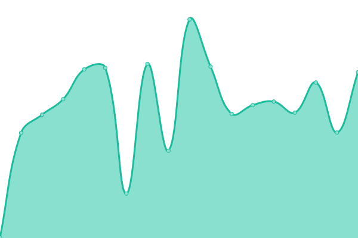
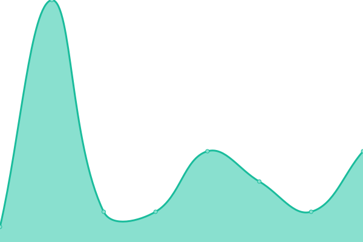
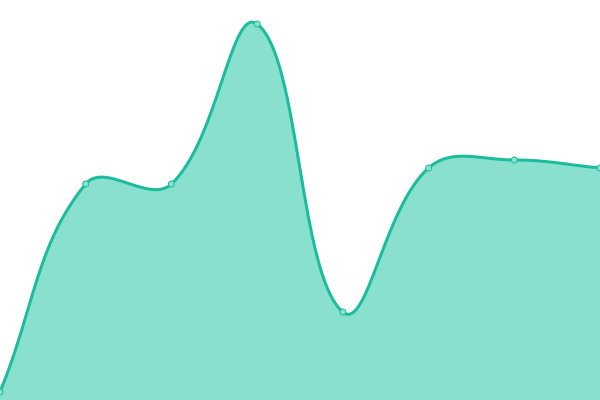

# [📈 Live Status](https://qingdog.github.io/upptime): <!--live status--> **🟧 部分停机**

This repository contains the open-source uptime monitor and status page for [qingdog](https://qingdog.github.io/upptime), powered by [Upptime](https://github.com/upptime/upptime).

With [Upptime](https://upptime.js.org), you can get your own unlimited and free uptime monitor and status page, powered entirely by a GitHub repository. We use [Issues](https://github.com/qingdog/upptime/issues) as incident reports, [Actions](https://github.com/qingdog/upptime/actions) as uptime monitors, and [Pages](https://qingdog.github.io/upptime) for the status page.

<!--start: status pages-->
<!-- This summary is generated by Upptime (https://github.com/upptime/upptime) -->
<!-- Do not edit this manually, your changes will be overwritten -->
<!-- prettier-ignore -->
| 链接 | 状态 | 历史 | 响应时间 | 正常运行时间 |
| --- | ------ | ------- | ------------- | ------ |
|  [Google](https://www.google.com) | 🟩 正常运行 | [google.yml](https://github.com/qingdog/upptime/commits/HEAD/history/google.yml) | 

 223毫秒
     
 | 

<a href="https://qingdog.github.io/upptime/history/google">100.00%</a>
    

|  [qingli.flowus.cn文档接口](https://qingli.flowus.cn/api/docs/3910f52e-bdd0-4e93-b38f-4396981ac5ff) | 🟩 正常运行 | [qingli-flowus-cn.yml](https://github.com/qingdog/upptime/commits/HEAD/history/qingli-flowus-cn.yml) | 

 1922毫秒
     
 | 

<a href="https://qingdog.github.io/upptime/history/qingli-flowus-cn">99.66%</a>
    

|  [Hacker News](https://news.ycombinator.com) | 🟥 停机 | [hacker-news.yml](https://github.com/qingdog/upptime/commits/HEAD/history/hacker-news.yml) | 

 309毫秒
     
 | 

<a href="https://qingdog.github.io/upptime/history/hacker-news">98.27%</a>
    

|  [Google DNS](8.8.8.8) | 🟩 正常运行 | [google-dns.yml](https://github.com/qingdog/upptime/commits/HEAD/history/google-dns.yml) | 

 5毫秒
     
 | 

<a href="https://qingdog.github.io/upptime/history/google-dns">100.00%</a>
    

|  [测试百度ipv6](https://www.baidu.com) | 🟩 正常运行 | [ipv6.yml](https://github.com/qingdog/upptime/commits/HEAD/history/ipv6.yml) | 

 2435毫秒
     
 | 

<a href="https://qingdog.github.io/upptime/history/ipv6">100.00%</a>
    

|  [POST请求维基百科](https://zh.wikipedia.org/) | 🟩 正常运行 | [post.yml](https://github.com/qingdog/upptime/commits/HEAD/history/post.yml) | 

 495毫秒
     
 | 

<a href="https://qingdog.github.io/upptime/history/post">100.00%</a>
    

|  [HowToAccessWikipedia](https://zh.wikipedia.org/wiki/Help:%E5%A6%82%E4%BD%95%E8%AE%BF%E9%97%AE%E7%BB%B4%E5%9F%BA%E7%99%BE%E7%A7%91) | 🟩 正常运行 | [how-to-access-wikipedia.yml](https://github.com/qingdog/upptime/commits/HEAD/history/how-to-access-wikipedia.yml) | 

 68毫秒
     
 | 

<a href="https://qingdog.github.io/upptime/history/how-to-access-wikipedia">100.00%</a>
    

<!--end: status pages-->

[**Visit our status website →**](https://qingdog.github.io/upptime)

## 📄 License

- Powered by: [Upptime](https://github.com/upptime/upptime)
- Code: [MIT](./LICENSE) © [Anand Chowdhary](https://anandchowdhary.com), supported by [Pabio](https://pabio.com)
- Data in the `./history` directory: [Open Database License](https://opendatacommons.org/licenses/odbl/1-0/)
