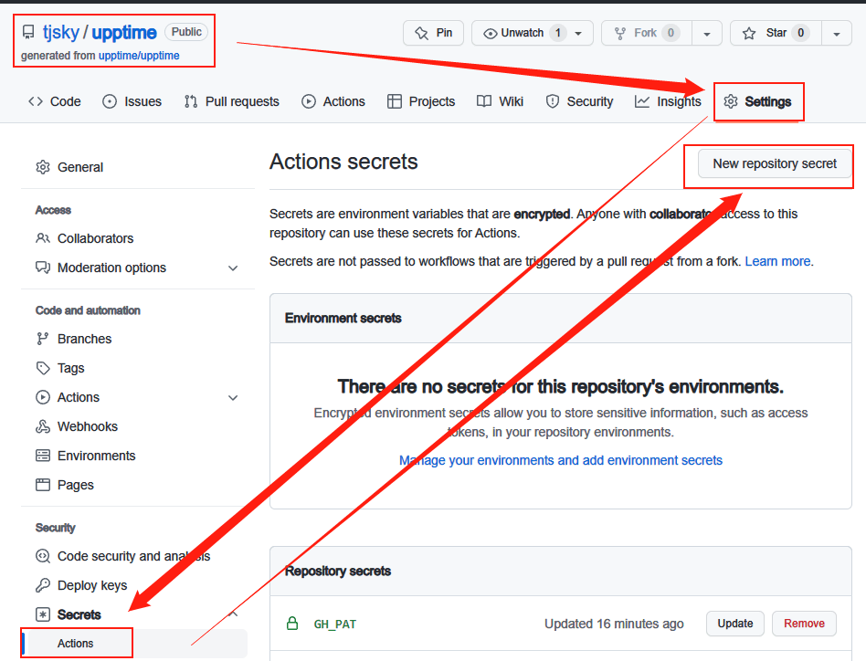

# 网页状态监控系统 Upptime 的一些高阶用法

浏览: 350 次浏览 作者: 去年夏天 分类: [佳软推荐](https://www.tjsky.net/category/best-software),[技术文章](https://www.tjsky.net/category/tutorial) 发布时间: 2022-09-20 15:32

# 前言

最近有构建网页集群状态监视系统的需求，经过在网上的一通翻找，找到了这个十分有创意的开源项目： Upptime

利用 GitHub Actions 每隔一段时间检查网站访问情况，若不能访问就创建 Issues 来回报异常事件,通过 GitHub Pages 生成服务状态的页面。

上一篇文章《用GitHub Actions 搭建网页状态监控系统 Upptime》介绍了最基础的部署步骤，下边补充一点更高阶的用法吧

文章目录

- [前言](https://www.tjsky.net/tutorial/456#i)

    - [更多监视类型](https://www.tjsky.net/tutorial/456#i-2)

        - [一般HTTP状态监视(GET请求)](https://www.tjsky.net/tutorial/456#HTTPGET)

        - [一般HTTP状态监视(其他请求)](https://www.tjsky.net/tutorial/456#HTTP)

        - [TCP ping 状态监视](https://www.tjsky.net/tutorial/456#TCP_ping)

        - [自定义Request headers](https://www.tjsky.net/tutorial/456#Request_headers)

        - [自定义Request body](https://www.tjsky.net/tutorial/456#Request_body)

        - [自定义站点图标](https://www.tjsky.net/tutorial/456#i-3)

        - [自定义状态代码](https://www.tjsky.net/tutorial/456#i-4)

        - [自定义站点超时时间](https://www.tjsky.net/tutorial/456#i-5)

        - [自定义返回内容监测](https://www.tjsky.net/tutorial/456#i-6)

    - [隐藏监控站点地址,请求参数](https://www.tjsky.net/tutorial/456#i-7)

    - [设置通知渠道](https://www.tjsky.net/tutorial/456#i-8)

        - [telegram](https://www.tjsky.net/tutorial/456#telegram)

        - [Email](https://www.tjsky.net/tutorial/456#Email)

---

## 更多监视类型

upptime不仅仅可以监视普通站点http状态，还有更多类型监控项目
只需要按格式修改增加`sites`部分代码即可

### 一般HTTP状态监视(GET请求)

```YAML
sites:
  - name: Google
    url: https://www.google.com
  - name: DuckDuckGo
    url: https://duckduckgo.com
```

YAML

Copy

### 一般HTTP状态监视(其他请求)

正常的请求方式都支持，比如POST,PUT,DELETE

```YAML
sites:
  - name: POST to Google
    url: https://www.google.com
    method: POST
  - name: DELETE Example
    url: https://example.com
    method: DELETE
  - name: PUT Example
    url: https://example.com
    method: PUT
```

YAML

Copy

### TCP ping 状态监视

```YAML
sites:
  - name: Google DNS 1
    check: "tcp-ping"
    url: 8.8.4.4
    port: 53
  - name: Google DNS 2
    check: "tcp-ping"
    url: 8.8.8.8
    port: 53
```

YAML

Copy

### 自定义Request headers

比如一些需要cookies认证的后台页面

```YAML
sites:
 - name: API endpoint
   url: https://example.com/get-user/3
   headers:
     - "Authorization: Bearer $SECRET_SITE_2"
     - "Content-Type: application/json"
```

YAML

Copy

### 自定义Request body

比如一些需要登录的后台页面

```YAML
sites:
 - name: API endpoint with data
   method: POST
   url: https://example.com/login
   headers:
     - "Content-Type: application/json"
   body: '{ "password": "hello" }'
```

YAML

Copy

### 自定义站点图标

监控状态页面内站点的图标，只需要给对应项增加icon参数即可

```YAML
sites:
  - name: Google
    url: https://www.google.com
    icon: https://www.google.com/favicon.ico
```

YAML

Copy

### 自定义状态代码

默认配置下，Upptim会将除了20X和30X以外的状态代码都视为站点异常，但如果你需要将40X，50X等状态代码视为正常状态，可以指定状态代码，只需要给对应项增加expectedStatusCodes参数即可

```YAML
sites:
  - name: Google
    url: https://www.google.com
    expectedStatusCodes:
      - 200
      - 201
      - 404
```

YAML

Copy

### 自定义站点超时时间

默认配置下，站点响应时间超过30秒才会会视为超时，你可以自行指定超时时间，以监视网站的异常卡顿，只需要给对应项增加maxResponseTime参数即可

```YAML
sites:
 - name: Slow endpoint
   url: https://example.com
   maxResponseTime: 5000
```

YAML

Copy

### 自定义返回内容监测

这个主要是用在某些会在网站异常时并不会抛出异常代码，而是通过其他措施返回200状态的定义提示网页。比如使用了某些奇怪的自定义404，502页面，前端会在后端异常时，返回正常自定义提示网页。
（这种设计其实违背了网页开发标准，自定义异常页应该正确回报状态代码+提示信息，而不是回报200代码+提示信息）
或者监测参数，key，是否过期（比如某个页面，已登录和未登录返回的内容不同，你想监控你的状态还在不在）只需要给对应项增加__dangerous__body_down参数即可

```YAML
sites:
  - name: Custom down
    url: https://example.com
    __dangerous__body_down: "请登录或注册后查看"
```

YAML

Copy

## 隐藏监控站点地址,请求参数

github是个开源代码平台，这个仓库也是Public的，任何人都可以从yml文件内看到你的监控配置
但有些时候，可能你想同时监控CDN后的状态和原站点状态，但又不想暴露源站的IP，或则一些需要监控的页面需要携带认证信息才可以正常访问，你不想把认证信息公开。比如上边[自定义Request headers](https://www.tjsky.net/?p=444#Request_headers)，[自定义Request body](https://www.tjsky.net/?p=444#Request_body)中的一些请求参数



1. 增加需要隐藏的内容

– Name: 基本上可以随便写，比如`site_main`,`key01`
– Value: 写域名或者需要隐藏的请求参数
– 点击 【Add secret】

比如我想隐藏域名的情况下监视谷歌的网页
– Name: `site_baidu`
– Value: `https://www.google.com`
– 点击 【Add secret】

比如我想隐藏GET请求中需要的key
– Name: `MY_API_KEY`
– Value: `aabbccddeeff11ppooiiuu2233`
– 点击 【Add secret】

1. 在yml文件中需要提及隐藏内容时，使用`$刚才设置的Name`替代。

比如我想隐藏域名的情况下监视谷歌的网页

```YAML
sites:
  - name: 我说这是百度
    url: $site_baidu
```

YAML

Copy

比如我隐藏GET请求中需要的key

```YAML
sites:
  - name: API endpoint
    url: https://example.com/get-user/3?api_key=$MY_API_KEY
```

YAML

Copy

这样其他人就无法看到你监视的到底是什么站点或者API的权限key了。

## 设置通知渠道

upptime可以在监控项目无法访问或性能降级时给你发送通知
在本文写作时支持，邮件（多种方式），短信（多种方式），Slack，telegram，Discord，Microsoft Teams

这里就以SMTP邮件和telegram为例（我默认你知道什么是SMTP邮件和telegram bot的设置）表格中汉字请替换为实际所指的内容。

### telegram


1. 添加以下secret

|Name|Secret|备注|
|-|-|-|
|NOTIFICATION_TELEGRAM|true|开启开关|
|NOTIFICATION_TELEGRAM_BOT_KEY|bot的API Token|可在 [@BotFather](https://www.tjsky.net/goto/?url=https://t.me/BotFather) 查询|
|NOTIFICATION_TELEGRAM_CHAT_ID|你的user ID|可在 [@userinfobot](https://www.tjsky.net/goto/?url=https://t.me/userinfobot) 查询|

### Email


1. 添加以下secret

|Name|Secret|备注|
|-|-|-|
|NOTIFICATION_EMAIL|true|开启开关|
|NOTIFICATION_EMAIL_FROM|发信邮箱地址||
|NOTIFICATION_EMAIL_TO|收信邮箱地址||

1. 添加以下secret

|Name|Secret|备注|
|-|-|-|
|NOTIFICATION_EMAIL_SMTP|true|SMTP发信渠道开关|
|NOTIFICATION_EMAIL_SMTP_PORT|SMTP服务器端口||
|NOTIFICATION_EMAIL_SMTP_HOST|SMTP服务器地址||
|NOTIFICATION_EMAIL_SMTP_USERNAME|SMTP登录用户名||
|NOTIFICATION_EMAIL_SMTP_PASSWORD|SMTP登录密码||

[Github](https://www.tjsky.net/tag/github)[tutorial](https://www.tjsky.net/tag/tutorial)[upptime](https://www.tjsky.net/tag/upptime)

一条评论

