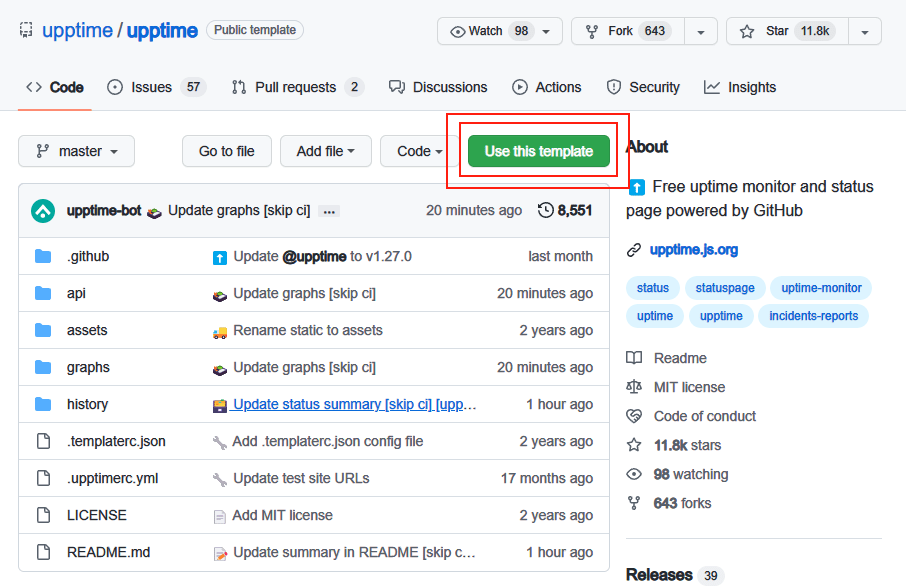
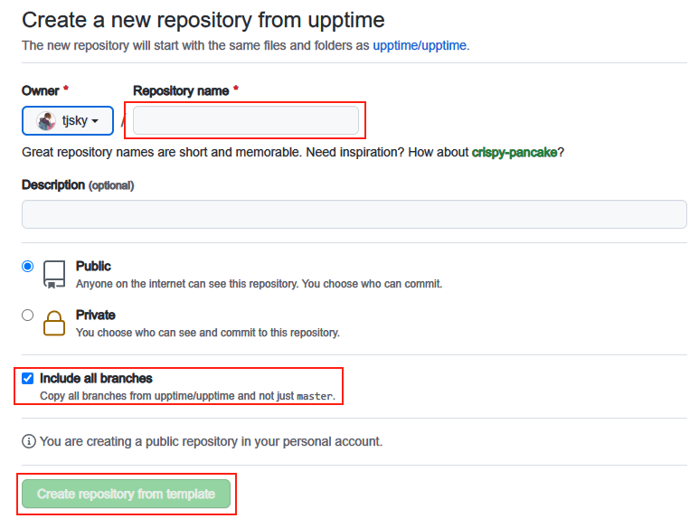
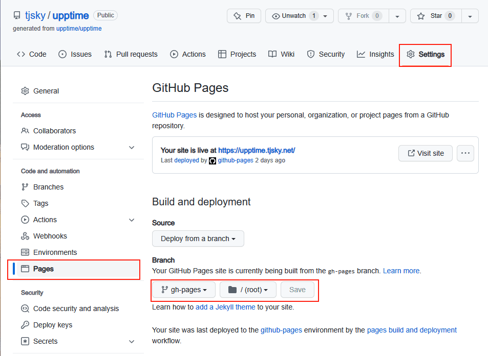
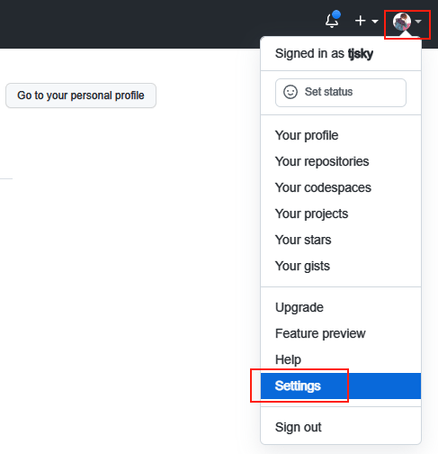
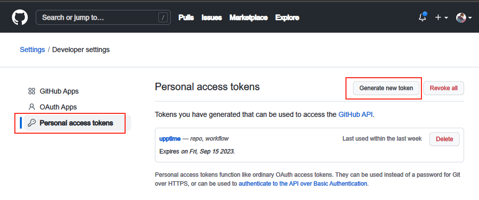
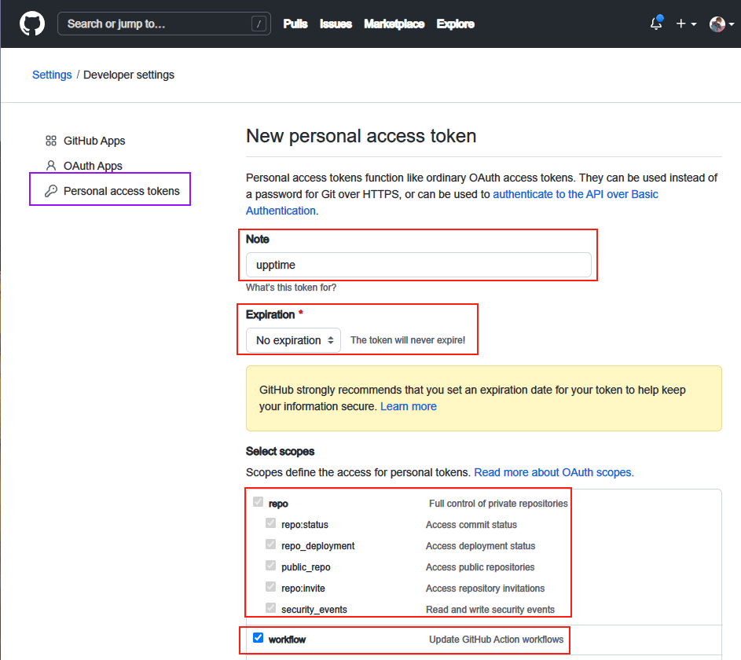
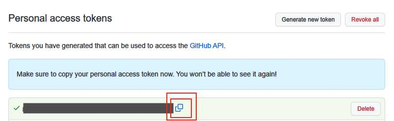
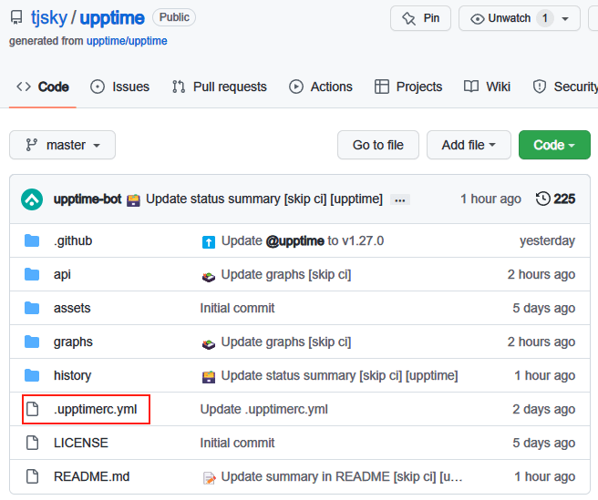
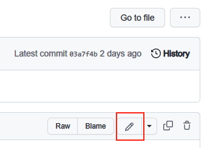
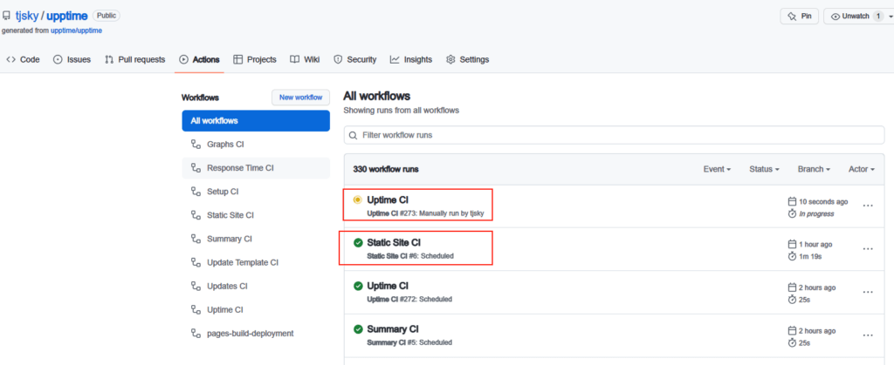

# 用 GitHub Actions 搭建网页状态监控系统 Upptime

浏览: 360 次浏览 作者: 去年夏天 分类: [佳软推荐](https://www.tjsky.net/category/best-software), [技术文章](https://www.tjsky.net/category/tutorial) 发布时间: 2022-09-20 15:03

利用 GitHub Actions 每隔一段时间检查网站访问情况，若不能访问就创建 Issues 来回报异常事件, 通过 GitHub Pages 生成服务状态的页面。

最近有构建网页集群状态监视系统的需求，难点主要在于有 20 多个站需要监控状态。
收费的网页状态这个量级的套餐大都有点贵，免费的要么没有这个量级的套餐，要么自己搭建的步骤过于复杂。
于是经过在网上的一通翻找，找到了这个十分有创意的开源项目： [Upptime](https://www.tjsky.net/goto/?url=https://github.com/upptime/upptime)

文章目录

- [Repo Upptime](https://www.tjsky.net/tutorial/444#Repo_Upptime)

- [GitHub Pages](https://www.tjsky.net/tutorial/444#GitHub_Pages)

- [给 Upptime-bot 设置 Repository Secret](https://www.tjsky.net/tutorial/444#_Upptime-bot_Repository_Secret)

- [更新配置文件，设定网页监控参数](https://www.tjsky.net/tutorial/444#i)

- [启动 GitHub Actions](https://www.tjsky.net/tutorial/444#GitHub_Actions)

- [访问监控状态页面](https://www.tjsky.net/tutorial/444#i-2)

- [汉化配置页](https://www.tjsky.net/tutorial/444#i-3)

- [结语](https://www.tjsky.net/tutorial/444#i-4)

---

# Repo Upptime

1. 访问 [Upptime](https://www.tjsky.net/goto/?url=https://github.com/upptime/upptime) 项目



**注意：这是个模版项目，所以不要像常见的项目那样，去直接点右上角的 fork。**



– 输入 Repository name（比如 upptime）
– 勾选 【Include all branches】
– 点击 【Create repository from temple】

1. 耐心等待几分钟，项目就会 fork 到你的账号下

# GitHub Pages



1. 进入你刚才 repo 到自己账号下的项目

2. 点右上角的 【Settings】

3. 在左侧 【Code and automation】 下找到 【Pages】

4. 将 【Branch】 设置为 【gh-pages】

5. 点击 【Save】

# 给 Upptime-bot 设置 Repository Secret

因为这个项目是利用 bot 实现自动化提交，需要给予 bot，commit 和 publish 的权限，所以我们需要设定一个 Personal Access Token






1. 新建 token

- Note: upptime

- Select scopes: 勾选【repo】和【workflow】（你直接勾 workflow，repo 就全勾上了）

- Expiration：选【No expiration】（无期限）






1. 给 bot 设定 token

– Name: GH_PAT
– Value: 上边第 5 步里复制的 token
– 点击 【Add secret】

# 更新配置文件，设定网页监控参数





1. 按照以下模版修改文件

```YAML
# 【】以及其中的内容，为说明文字，需要替换为你自己的设置。
# 『』以及其中的内容，为示例参数，需要替换为你自己的设置。

#你的GitHub username 
owner: 【你的 GitHub username】『tjsky』

#你的GitHub repo name 
repo: 【你的 repo name】『upptime』


#下边写的时候一定注意代码的缩进让，“-” 都在同一个竖线上，“name”和“url”也都在同一个竖线上，层次不齐的代码高几率直接报错
sites:
  - name: 【要监控的第一个网页的名称】『Google』
    url: 【要监控的第一个网页的域名】『https://www.google.com』
  - name: 【要监控的第二个网页的名称】『Wikipedia』
    url: 【要监控的而网页的域名】『https://en.wikipedia.org』


# A-如果你的监控控制台页面，打算使用github的默认域名，则使用如下设置。和下边B设置互斥，请二选一
status-website: 
  baseUrl: 【/你的 repo name】『/upptime』

# B-如果你的监控控制台页面，打算使用自己所有的域名，则使用如下设置，和上边A设置互斥，请二选一
status-website: 
  cname: 【你的域名】『upptime.tjsky.net』

#自定义状态页面的navbar名称与链接
  logoUrl: 【控制台网页logo地址】『https://raw.githubusercontent.com/upptime/upptime.js.org/master/static/img/icon.svg』
  name:【控制台网页名字】 『Upptime』
  introTitle: 【网页标题】『这里可以随便写的啦，比如写：这是使用upptime构建的开源网页状态监控页』
  introMessage: 【网页简介】『这里可以随便写的啦』
  navbar:
    - title: Status
      href: /
    - title: GitHub
      href: https://github.com/$OWNER/$REPO
```

YAML

Copy

1. 修改完成后在点击页面最下的【Commit changes】按钮，提交修改。

# 启动 GitHub Actions



一般情况下，在你修改.upptimerc.yml 后，Actions 就会自动开始运行。
你会看到一个黄圈圈在转。运行成功会显示绿色的勾，运行失败会显示红色的叉。
如果出现红叉，一般都是你修改 yml 文件时，什么地方写错了，比如少打了一个字母啊，空格漏了啊，代码对齐有问题，少写了什么必须设置的参数，什么参数设置错误了。请仔细检查。

# 访问监控状态页面


1. 进入你刚才 repo 到自己账号下的项目

2. 点右上角的 【Settings】

3. 在左侧 【Code and automation】 下找到 【Pages】

4. `Your site is live at XXXXXX` 这里就是你的监控状态页面啦

5. Active Incidents 显示目前的异常事件，Live Status 显示目前监控状态，Past Incidents 显示过去的异常事件

# 汉化配置页

把如下内容粘贴到.upptimerc.yml 的最后

```YAML
i18n:
  activeIncidents: 活动事件
  allSystemsOperational: 所有系统都可以正常运行
  incidentReport: "事件 #$NUMBER 报告 →"
  activeIncidentSummary: 在 $DATE 打开，有 $POSTS 个帖子
  incidentTitle: 事件 $NUMBER 的详细信息
  incidentDetails: 事件详细信息
  incidentFixed: 已修复
  incidentOngoing: 正在进行
  incidentOpenedAt: 开始于
  incidentClosedAt: 结束于
  incidentSubscribe: 订阅更新
  incidentViewOnGitHub: 在 GitHub 上查看
  incidentCommentSummary: 由 $AUTHOR 在 $DATE 发布
  incidentBack: ← 返回所有事件
  pastIncidents: 过去的事件
  pastIncidentsResolved: $POSTS 个问题在 $MINUTES 分钟内得到解决
  liveStatus: 实时状态
  overallUptime: "总体正常运行时间： $UPTIME"
  overallUptimeTitle: 总体正常运行时间
  averageResponseTime: "平均响应时间: $TIMEms"
  averageResponseTimeTitle: 平均响应时间
  sevelDayResponseTime: 7 天响应时间
  responseTimeMs: 响应时间（毫秒）
  ms: 毫秒
  loading: 加载中
  navGitHub: GitHub
  footer: gd1214b保留所有权利。 Copyright © 2021 gd1214b. All Rights Reserved.
  rateLimitExceededTitle: 超出速率限制
  rateLimitExceededIntro: 您已超过一小时内可以执行的请求数，因此您必须等待才能再次访问此网站。或者，您可以添加 GitHub 个人访问令牌以继续使用本网站。
  rateLimitExceededWhatDoesErrorMean: 这个错误是什么意思？本网站使用 GitHub API 访问有关我们网站状态的实时数据。默认情况下，GitHub 允许每个 IP 地址每小时 60 个请求，您已经消耗了这些请求。
  rateLimitExceededErrorHowCanFix: 我该如何解决？
  rateLimitExceededErrorFix: 您可以再等一个小时，您的 IP 地址限制将恢复。或者，您可以添加您的 GitHub 个人访问令牌，这将为您提供每小时额外 5,000 个请求。
  rateLimitExceededGeneratePAT: 了解如何生成个人访问令牌
  rateLimitExceededHasSet: 您有一个个人访问令牌集。
  rateLimitExceededRemoveToken: 删除令牌
  rateLimitExceededGitHubPAT: GitHub 个人访问令牌
  rateLimitExceededCopyPastePAT: 复制并粘贴您的令牌
  rateLimitExceededSaveToken: 保存令牌
  errorTitle: 发生错误
  errorIntro: 尝试获取最新状态详细信息时出错。
  errorText: 您可以稍后再试。
  errorHome: 转到主页
  pastScheduledMaintenance: 过去的预定维护
  scheduledMaintenance: 定期维护
  scheduledMaintenanceSummaryStarted: 从 $DATE 开始，持续 $DURATION 分钟
  scheduledMaintenanceSummaryStarts: 从 $DATE 开始，持续 $DURATION 分钟
  startedAt: 开始在
  startsAt: 开始于
  duration: 持续时间
  durationMin: $DURATION 分钟
  incidentCompleted: 已完成
  incidentScheduled: 已预定
  url: "链接"
  status: "状态"
  history: "历史"
  responseTime: "响应时间"
  uptime: "正常运行时间"
  up: "🟩 正常运行"
  degraded: "🟨 运行缓慢"
  down: "🟥 停机"
  responseTimeGraphAlt: "响应时间图像"
  responseTimeDay: "24 小时响应时间"
  responseTimeWeek: "7 天正常运行时间"
  responseTimeMonth: "30天的正常运行时间"
  responseTimeYear: "1年的正常运行时间"
  uptimeDay: "24 小时正常运行时间"
  uptimeWeek: "7 天正常运行时间"
  uptimeMonth: "30天的正常运行时间"
  uptimeYear: "1年的正常运行时间"
  liveStatusHtmlComment: "<！ -实时状态- >"
  degradedPerformance: "🟨 性能降低"
  completeOutage: "🟥 全部停机"
  partialOutage: "🟧 部分停机"
```

YAML

Copy

# 结语

- upptime 可以实现的功能远不止于此，还可以实现 TCP 监视，监视网页内容，监视网页延迟，隐藏监控，自定义监控频率，自定义通知渠道（比如通过邮件，短信，telegram 机器人，webhook，Discord 发送异常通知）详情请查看后续文章 [《网页状态监控系统 Upptime 的一些高阶用法》](https://www.tjsky.net/?p=456)

- 虽然理论上他是 5 分钟监控一次，但 github 大部分时间不允许这么短的间隔，所以实际会是每隔 10~20 分钟监控一次。


[监控配置](%E9%83%A8%E7%BD%B2%E5%92%8C%E9%85%8D%E7%BD%AE+25d22e53-d987-4116-b0fa-e9c02a51fc06/%E7%9B%91%E6%8E%A7%E9%85%8D%E7%BD%AE%205db63ba1-999f-4882-b19c-f88e2f10aa2a.md)

